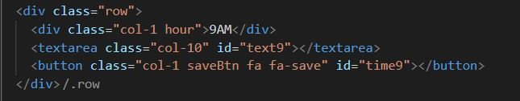
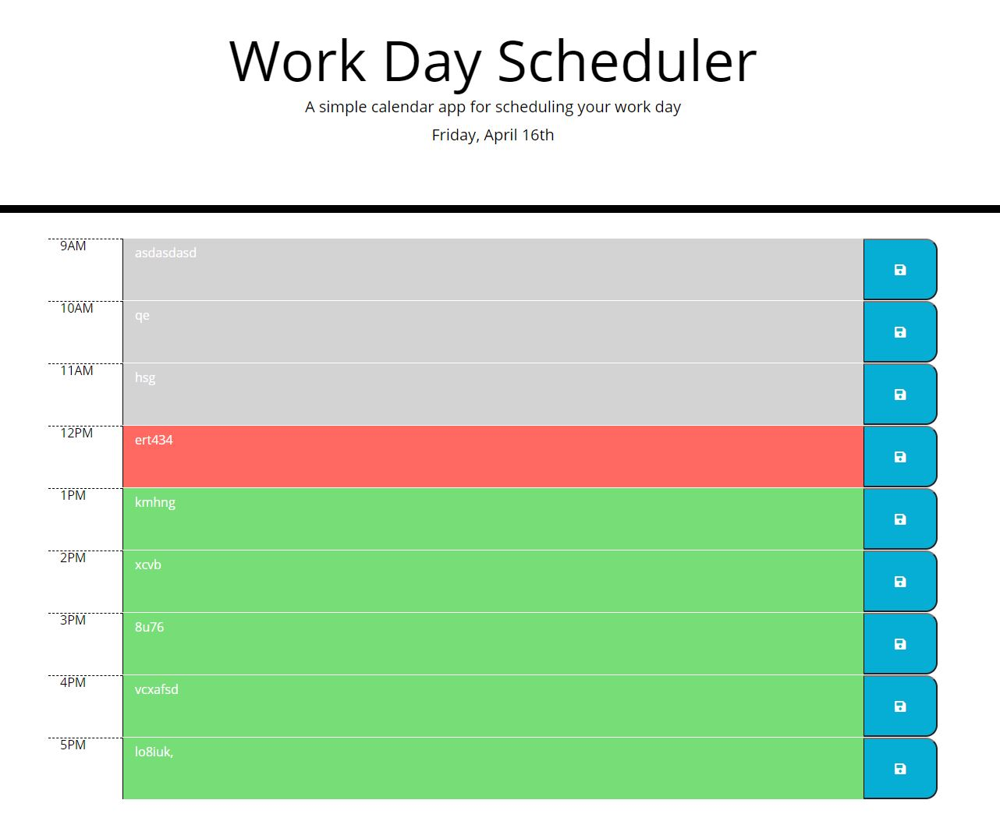
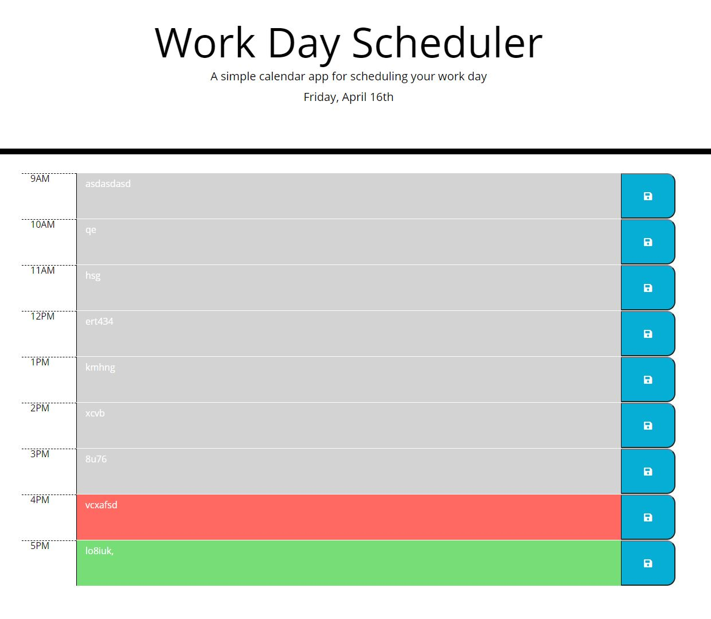

# HW5 - Third party APIs

The purpose of this activity was to implement different frameworks and third party APIs in order to develop a simple webpage that displayed useful information that changes dynamically through the day

The task consisted in complementing a webpage that we were given. The webpage had an incomplete header and some styles that were defined but were not implemented. Our job was to create elements that could use these styles and add functionality to them using javascript in such a way that it behaved as follows:

## When the webpage is displayed, then:
* The user can see the current day and month in the header
* The user can see multiple 9 rows, each row has an hour, text area and save button
* The user can input information in each text area
* When the save buttons are pressed, the page will store the text that inhabits the text area locally
* If the page is refreshed, the stored information must show in their corresponding text areas
* Depending on the time of the day, each text area must change of color, green for future, red for present and gray for past

After implementing all of the previous requirements, we were supposed to have a webpage that could be implemented as a daily calendar

## Technologies

This project was developed using:
* CSS3
* HTML5
* JavaScript
* JQuery
* Bootstrap
* MomentJS

## Setup

To run this project clone this repository in a folder and open the html file, there is also a deployed webpage that shows the final version of the project, you can access it by opening the link at the end of this file

## Development process

This activity consisted in modifying a basic html file that only had fraction of the header and no body. The header was complemented by adding the current day using javascript. 

The body was developed using bootstrap. The logic was the following:
* Creates a row for each hour (from hour 9 to hour 17)
* The 12 columns are shared using the following sintaxis
* 1 column is used to display the hour
* 10 columns are used to display the text area
* 1 column is used to display the save button
* The textarea has an id that is used in the javascript file to retrieve and display information in the element
* The button has an id that is used to listen to clicks and store the data locally

&nbsp;The basic structure of the html row implementation can be seen in the following image.

|   | 
| ------------- |
| html structure for each row |

The javascript code was in charge on adding the date to the header, locally storing and restoring the locally stored information into their corresponding text areas and changing the text area background colors depending on the time of the day.

The final product was a daily calendar that was capable of storing the information the user typed into the text boxes, was able to store the information locally and updated the text boxes with the stored information once the page was refreshed. The final product was the following:

| |    | 
| ------------- | ------------- |
| Final product at 12pm | Final product at 4pm |

&nbsp;

## Deployed webpage:
* https://erickcc.github.io/HW5-Third-Party-APIs/
